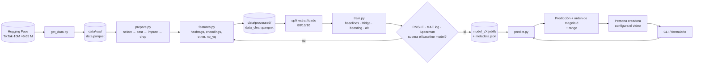

# Mapa del sistema de ML — TEE (TikTok Engage Estimator)

## 1. Contexto

**Problema:** 
Para creadores, marcas y agencias, el alcance de un video de TikTok (reproducciones) es la métrica que define si una pieza funcionó. Ese resultado solo se conoce *después* de publicar: qué grabar, con qué música, qué duración, qué hashtags y desde qué lugar se decide sin ninguna estimación cuantitativa. Las herramientas de analítica de TikTok muestran resultados a posteriori y la intuición sobre "qué funciona" es anecdótica.

TEE estima `play_count` usando exclusivamente información disponible antes de publicar. Formalmente: dado un vector $x$ observable al momento de publicar (configuración, música, texto, hashtags, POI, duración, calidad), se busca $\hat{f}(x) \approx \mathbb{E}[\log(1 + \text{play\_count}) \mid x]$, o equivalentemente un estimador del orden de magnitud del alcance.

**Por qué el problema es difícil (antecedentes):** 
La literatura predice bien la popularidad cuando hay señal *temprana* (Szabo & Huberman, 2010) o *social* del autor (Khosla, 2014, donde los factores sociales dominan pero el contenido intrínseco aporta señal no trivial). Para video corto, Chen(2016) y Ling(2022) confirman que texto, hashtags y música sí informan. TEE elimina deliberadamente la señal temprana y el dataset no expone seguidores ni historial del autor, así que el modelo trabaja en el escenario más adverso: casi solo factores intrínsecos y de configuración.

**Usuario / sistema consumidor:** 
** Una persona creadora o equipo de contenido que, al configurar la publicación, quiere conocer el orden de magnitud esperado del alcance (10³ vs. 10⁶) y qué palancas moverían la estimación.

**Decisión que apoya la predicción.** 
Ajustar decisiones controlables antes de publicar: música, duración, hashtags/descripción, POI etiquetado y configuración de propagación (duet, stitch, repost, share, comentarios). Objetivo específico 5 del proyecto: identificar qué decisiones controlables tienen efecto medible.

**Hipótesis de trabajo.** 
Las variables a priori explican una fracción modesta pero estadísticamente significativa de la varianza de `log(play_count)`: suficiente para discriminar órdenes de magnitud, no para valores puntuales.

- *Supuesto:* el orden de magnitud es útil para el creador aunque la estimación puntual sea imprecisa.
- *Supuesto:* el usuario acepta una estimación condicionada a contenido *trending* con POI en EE. UU. (primavera 2025); fuera de ese dominio la predicción no es confiable.
- *Pregunta pendiente:* ¿el consumidor final es un formulario interactivo (un video a la vez) o un reporte por lote sobre varios videos planeados?
- *Pregunta pendiente:* ¿la salida debe incluir explicaciones por feature (qué palanca mover) o solo la estimación?

## 2. Nivel de datos

### Evidencia del EDA (`notebooks/01-eda.py`, muestra de ~2 M registros)

- **Fuente:** 
[The-data-company/TikTok-10M](https://huggingface.co/datasets/The-data-company/TikTok-10M)
  (Hugging Face), ≈ 10 M publicaciones en Parquet (~9 GB). Licencia reportada como "other"; declarado construido con datos públicos para investigación. Contenido *trending* con POI en Estados Unidos, primavera 2025. Diccionario completo en [`data/README.md`](../data/README.md).
- **Unidad de observación:** 
Una fila = una publicación (video) con sus métricas de interacción en un momento dado, metadatos de creador, audio, POI y configuración.
- **Target:** 
`play_count`, con varianza y sesgo altos (cola pesada), visible en boxplot e histograma en escala log.
- **Tipos inapropiados en la fuente:** banderas como `is_ad` vienen como cadenas `'t'`/`'f'`; campos temporales como cadena; `music_id`, `city_code` y `diversification_id` como `float64`.
- **Nulos:** individualmente marginales por columna, pero exigir registros completos deja <1 % de los datos. Imputando solo numéricas y eliminando residuales se descarta ≈15 % de la muestra.
- **Duplicados de `id`:** 
proporción muy pequeña.
- **Booleanas:** 
las nueve están muy desbalanceadas (ninguna cerca del 50 %) y sus distribuciones de `play_count` (violin plots en log) son casi idénticas entre clases; las diferencias aparecen justo en las más desbalanceadas, lo que las hace poco confiables.
- **Colinealidades:** 
`city`/`city_code` (`city` tiene >50 % nulos), `poi_category`/`poi_tt_type_name_super`, `poi_tt_type_name_tiny`/`poi_tt_type_code`; `duration`/`music_duration` altamente correlacionadas.
- **Constantes:** 
`country_code`, `duet_display`, `stitch_display`.
- **Numéricas vs. target:** 
sin relación aparente en scatter/pairplot.
- **vq_score:** 
muchos valores en 0.
- **Cardinalidad:** 
solo ~5 nominales tienen ≤364 clases (estimables con medias condicionales); el resto supera 1 000 valores distintos. `desc` tiene una clase dominante pero demasiada variedad; `address` muestra un codo de Pareto claro que permite agrupar la cola en `other`.
- **`music_title` vs. `music_id`:** 
cardinalidades muy distintas; hipótesis: muchas canciones comparten título.

### Decisión inicial

- **Features a priori (28):**
  - Booleanas (9): `duet_enabled`, `is_ad`, `item_mute`, `item_control_can_repost`, `official_item`, `original_item`, `share_enabled`, `stitch_enabled`, `music_original`.
Justificación: configuración explícita del creador que afecta la propagación.
  - Nominales (16): `desc`, `address`, `poi_name`, `city_code`, `poi_category`, `poi_tt_type_name_medium`, `poi_tt_type_name_tiny`, `challenges`, `music_id`, `music_title`, `music_album`, `duet_info_duet_from_id`, `music_author_name`, `poi_id`, `diversification_id`, `item_comment_status`.
    Justificación: texto, hashtags, música y ubicación son las modalidades que
    la literatura identifica como informativas y que se fijan antes de publicar.
  - Numéricas (3): `duration`, `music_duration`, `vq_score`.
    Justificación: características de producción controlables.
- **Excluidas por leakage:** 
`digg_count`, `comment_count`, `share_count`, `collect_count` (material del target, no features), `create_time`, `stats_time`, `collected_time`.
- **Excluidas por privacidad / ausencia de señal social deliberada:**
`user_id`, `user_verified`, `user_tt_seller`, avatares, `url`, `share_cover`, `music_play_url`.
- **Descartadas por redundancia o degeneración:** 
`city`, `poi_tt_type_name_super`, `poi_tt_type_code`, `country_code`, `duet_display`, `stitch_display`.
- **Target modelado:** `log(1 + play_count)`.

#### Implementaciones pendientes

- **Preparación (`notebooks/02-preparacion.py`, pandas, `.pipe()`):**
  `select_columns → cast_types → impute_numericals → drop_residual_nulls`.
  - `cast_types`: booleanas a `boolean` nullable (evita convertir nulos a
    `True` silenciosamente) y a `bool` nativo al final; `*_id` a `category`;
    nominales a `string`; numéricas y target con coerción numérica.
  - `impute_numericals`: univariada por columna, mediana si |skew| > 1,
    media en caso contrario (Little & Rubin, 2019).
  - Salida prevista: `data/processed/data_clean.parquet` (hoy solo se escribe
    si se descomenta la última celda; no versionado). [TODO]

- **Validaciones a implementar:** esquema de columnas y tipos; rango de
  `duration`, `music_duration` y `vq_score`; ausencia de columnas de
  engagement y de usuario en la matriz de features; proporción de nulos por
  columna antes de imputar; unicidad de `id`.

### Supuestos

- Imputar solo numéricas es suficiente; las nominales con nulos se agrupan
  (`other`/`unknown`) o se descartan.
- Los datos son representativos de contenido orgánico *trending* en EE. UU.;
  el desempeño no generaliza a otros países ni periodos y el sesgo de muestreo
  puede inflar el desempeño aparente.
- Una muestra del 20 % (`random_state=69`) reproduce las distribuciones del
  total.
- Eliminar los `id` duplicados no introduce sesgo.

### Preguntas pendientes

- ¿`log(1 + y)` o Box-Cox / yeo-jhonson? Se decidirá comparando residuales.
- ¿Umbral para agrupar colas en `other` en `address`, `city_code`, `poi_tt_type_name_*` y `diversification_id`?
- ¿`music_title` vs. `music_id`: se conserva uno o los dos?
- ¿Bandera `no_vq` para `vq_score == 0` o discretización?
- ¿Es el 15 % descartado por nulos un sesgo sistemático (p. ej., videos sin POI o sin música)?
- ¿Cómo se representa `challenges` (lista JSON de hashtags) y `desc` (texto libre con menciones y hashtags) como features?

### Estrategia de particiones

Train / busqued/ prueba = 80 / 10 / 10, estratificado por cuantiles de
`log(1 + play_count)`. El conjunto de prueba se toca una sola vez al final.
Alternativa a evaluar: partición temporal por `create_time` para simular
"predecir videos futuros".

## 3. Nivel del modelo

### Evidencia del EDA

- Las numéricas no muestran relación sencilla con el target y las booleanas
  discriminan poco: la señal, si existe, está en texto (`desc`), hashtags
  (`challenges`), música y POI. Conclusión del EDA: el énfasis debe ir en la
  ingeniería de features de las variables de texto.
- El target requiere transformación y métricas robustas a colas pesadas.
- Alta cardinalidad en `music_id`, `poi_id`, `challenges`, `desc`: requiere
  target/frequency encoding, embeddings o extracción de features textuales.

### Decisión inicial

- **Tarea:** regresión sobre `log(1 + play_count)`. Formulación alternativa
  a evaluar: clasificación ordinal por orden de magnitud (10³, 10⁴, 10⁵, 10⁶+).
- **Baselines triviales:** media, mediana y mediana por categoría
  (`poi_category`) en escala log.
- **Familias de modelos (objetivo específico 3: al menos tres):**
  1. Lineal regularizada (Ridge/Lasso) — baseline interpretable.
  2. Gradient boosting (LightGBM o XGBoost) — modelo principal.
  3. Alternativa por definir (clasificación ordinal, o un modelo sobre
     embeddings de texto).
- **Métrica principal:** RMSLE. **Secundarias:** MAE en escala log y
  correlación de Spearman (mide si el modelo ordena bien los videos, que es
  lo que importa para discriminar órdenes de magnitud).
%% - **Salida del entrenamiento:** métricas en validación y prueba por modelo,
  importancia de variables (permutación / SHAP) para responder el objetivo 5
  (qué palancas controlables tienen efecto) y el artefacto del mejor. %%
- **Artefacto esperado:** un solo objeto serializado (`joblib`) con el
  preprocesador (encoders, imputadores, transformación del target) y el
  estimador, más un `metadata.json` con versión, fecha, lista de features,
  hash del dataset y métricas, esto en caso de que el modelo pertenezca al ecosistema de scikit-learn.
  en caso contrario se necesita mas investigacion sobre como se guardan los artefactos o modelos (e.g pytorch models, xgboost, etc.)

### Supuestos

- Las variables a priori explican una fracción modesta pero significativa de
  la varianza (hipótesis del proyecto); el modelo será útil para discriminar
  órdenes de magnitud, no para valores puntuales.
- Boosting capturará interacciones que un modelo lineal no.
- Existe un "techo de predictibilidad" sin señal social; cuantificarlo es un
  resultado del proyecto, no un fracaso del modelo.

### Preguntas pendientes

- **Criterio de aceptación:** no puede fijarse hasta correr los baselines.
  Propuesta: "supera la mediana por categoría en RMSLE y alcanza Spearman
  claramente positivo en prueba"; el umbral numérico se define tras el
  primer experimento.
- ¿LightGBM o XGBoost? Se decide por tiempo de entrenamiento en ~1.7 M filas.
- ¿Target encoding con validación anidada para `music_id` y `poi_id` (riesgo
  de leakage dentro del fold)?
- ¿TF-IDF o embeddings para `desc`? Depende de costo computacional.
- ¿Cómo tratar el desbalance de las booleanas: se dejan, se combinan en un
  índice de "propagación habilitada" o se descartan?

## 4. Nivel de código

### Estado actual (evidencia)

- `data/raw/get_data.py`: descarga desde Hugging Face con `datasets`, (oculto por el .gitignore)
  escribe `data.parquet` (~9 GB) y genera `sample_data.parquet` (20 %).
- `notebooks/01-eda.py` y `notebooks/02-preparacion.py` (marimo, con exports
  a Jupyter): EDA y pipeline de preparación factorizado en funciones
  encadenables con `.pipe()`.
- `pyproject.toml` + `uv.lock`: dependencias reproducibles con `uv sync`;
  Python ≥ 3.12.
- `docs/propuesta.md`: contexto, objetivos, EDA y siguientes pasos.
- La salida de la preparación **no es persistente** todavía: los notebooks
  son para EDA y prueba del pipeline inicial.

### Componentes probables

| Componente | Responsabilidad | Estado |
|---|---|---|
| `src/tee/data.py` | Carga de Parquet y validaciones de esquema (Contrato 1) | por crear |
| `src/tee/prepare.py` | Funciones del pipeline actual, extraídas de `02-preparacion.py` | por migrar/refactorizar |
| `src/tee/features.py` | Conteo/longitud de hashtags (`desc`, `challenges`), target/frequency encoding (`music_id`, `poi_id`, `poi_category`), agrupación `other`, bandera `no_vq` | por crear |
| `src/tee/train.py` | Split, baselines, entrenamiento de las tres familias, evaluación, serialización | por crear |
| `src/tee/predict.py` | Carga del artefacto e inferencia sobre un `DataFrame` (Contrato 2) | por crear |
| `app/` o CLI | Consumidor: formulario mínimo que arma el vector de entrada | por definir |

### Dependencias o configuración por investigar

- `lightgbm` / `xgboost`, `scikit-learn`, `shap`, `category_encoders` (o
  target encoding propio); posiblemente `sentence-transformers` si se usan
  embeddings para `desc`.
- Configuración en `config.toml` o variables de entorno: rutas de datos,
  `random_state`, fracción de muestra, umbrales de agrupación, cuantiles del
  split.
- Cómo persistir `data/processed/` sin versionarlo (sigue en `.gitignore`).
- Migrar del formato marimo a módulos importables sin perder la ejecución
  interactiva.

### Señales que convendría registrar

- Filas de entrada, filas descartadas y proporción de nulos por columna en
  cada corrida de preparación (hoy sabemos que es ≈15 %, hay que vigilarlo).
- Métricas por modelo y por fold; tiempo de entrenamiento.
- Versión del artefacto usada en cada predicción y distribución de las
  predicciones (para detectar deriva de entrada más adelante).
- Proporción de entradas que caen en `other`/`unknown` en inferencia
  (indica que el consumidor manda valores fuera del dominio de entrenamiento).

## 5. Interfaces

**Contrato 1 — Datos preparados → entrenamiento.** Parquet con exactamente
28 columnas + `play_count`; booleanas como `bool`, `*_id` como `category`,
nominales como `string`, `duration`/`music_duration`/`vq_score` como `float`.
Cualquier columna de engagement, de usuario o temporal presente hace fallar
la validación.

**Contrato 2 — Entrada de inferencia (consumidor → modelo).** Una fila (o un
`DataFrame`) con las 28 features en los mismos tipos; se permiten nulos en
nominales (se mapean a `other`/`unknown`) pero no en numéricas. El modelo
devuelve la predicción en escala log y en escala original (`expm1`). (sujeto a cambios por las features)

**Contrato 3 — Artefacto.** `model_vX.Y.Z.joblib` con preprocesador y
estimador en un solo `Pipeline`, acompañado de `metadata.json`:
`{version, fecha, features, transformacion_target, metricas_val, metricas_test, hash_dataset, random_state}`.

**Contrato 4 — Salida hacia la persona usuaria.** Predicción puntual, orden
de magnitud (bucket) y, si el modelo lo permite, un rango (p. ej. cuantiles
10–90 o intervalo derivado del error en validación). Opcional: top-k
features que más empujan la estimación (objetivo 5).

- *Pregunta pendiente:* ¿`challenges` entra como lista de strings y
  `features.py` la parsea, o el consumidor ya manda los conteos?

## 6. Forma de operación

**Entrenamiento: offline.** El dataset es un *snapshot* estático (primavera
2025) y no hay flujo de datos nuevos; reentrenar solo tiene sentido cuando
cambie el conjunto de features, se escale al dataset completo o llegue una
nueva versión del dataset. Aprendizaje incremental no aporta nada aquí y
complicaría la reproducibilidad, que es un objetivo explícito del proyecto.

**Inferencia: bajo demanda.** El caso de uso es una persona que está por
publicar y quiere una estimación para *ese* video; la entrada no existe hasta
que ella la configura, así que no se puede precomputar. Se mantiene un modo
por lote (un `DataFrame` de varios videos) porque es el mismo código y sirve
para evaluación y para el escenario "varios videos planeados".

- *Supuesto:* volumen de consultas bajo (decenas al día), latencia no crítica.
- *Supuesto:* el dominio de entrada se mantiene (trending, EE. UU.); si el
  consumidor manda videos fuera de ese dominio, la estimación no es válida y
  conviene señalarlo.## 7. Patrón de serving

| Patrón | A favor | En contra para TEE |
|---|---|---|
| Model-as-Service (API HTTP) | Centraliza versión y monitoreo; múltiples clientes | Requiere servicio, hosting y contrato HTTP que aún no existen |
| Model-as-Dependency (artefacto cargado en el proceso consumidor) | Mínimo componente nuevo; misma máquina; fácil de probar; reproducible con `uv` | Actualizar el modelo implica redistribuir el artefacto |
| Precompute (tabla de predicciones) | Latencia cero | Imposible: la entrada es una combinación nueva por video |

**Decisión inicial: Model-as-Dependency.** El consumidor inicial es un
script/formulario ligero (CLI o Streamlit) que carga `model_vX.Y.Z.joblib`
mediante `src/tee/predict.py`. Con un solo consumidor y bajo volumen, un
servicio HTTP sería infraestructura sin beneficio. Migrar a Model-as-Service
es el siguiente paso natural si aparece un segundo consumidor; el Contrato 2
y el artefacto ya están diseñados para que ese cambio no toque el modelo.

## 8. Diagrama

## 9. Riesgo prioritario

**Brecha.** El EDA sugiere que las features a priori tienen poca señal: las
booleanas casi no discriminan y las numéricas no muestran relación con el
target. Toda la apuesta recae en texto, hashtags, música y POI, que todavía
no tienen ingeniería de features, y no sabemos si el modelo superará a la
mediana por categoría. La literatura (Khosla et al., 2014) advierte que sin
señal social el problema es sustancialmente más difícil.

**Consecuencia.** Podríamos invertir en boosting, encodings, embeddings y
consumidor para terminar con un modelo que no aporta sobre un baseline
trivial, sin haberlo detectado a tiempo. Además, sin un piso medido, no se
puede responder la pregunta de fondo del proyecto (cuánto explica lo
controlable), que es un resultado válido incluso si el modelo es débil.

**Siguiente incremento.** Persistir `data/processed/data_clean.parquet`,
implementar el split estratificado y los tres baselines triviales, y entrenar
un Ridge con solo las ~5 nominales de baja cardinalidad más las numéricas.
Eso da en pocas horas un piso de RMSLE y Spearman contra el cual medir cada
feature nueva. Si Ridge no supera la mediana por categoría, se prioriza la
ingeniería de `desc`/`challenges` antes de cualquier otra cosa.

## 10. Fuentes y supuestos por validar

### Fuentes

- Dataset: https://huggingface.co/datasets/The-data-company/TikTok-10M
- Diccionario de datos del proyecto: [`data/README.md`](../data/README.md)
- Propuesta del proyecto: [`docs/propuesta.md`](propuesta.md)
- Informe del proyecto: `informe-final.ipynb` (ajustar ruta según dónde quede
  en el repo)
- Chen et al. (2016), *Micro Tells Macro*; Khosla et al. (2014), *What Makes
  an Image Popular?*; Ling et al. (2022), *Slapping Cats, Bopping Heads, and
  Oreo Shakes*; Szabo & Huberman (2010), *Predicting the Popularity of Online
  Content*; Little & Rubin (2019), *Statistical Analysis with Missing Data*.
- Clase 9 del curso: tres niveles del software de ML.

### Por validar

- [ ] Términos exactos de la licencia "other" del dataset y si permite un
      consumidor distribuible.
- [ ] Que el 15 % descartado por nulos no introduce sesgo sistemático.
- [ ] Que la muestra del 20 % reproduce las distribuciones del total.
- [ ] Que `music_title` y `music_id` no aportan información redundante.
- [ ] Umbral numérico del criterio de aceptación (tras baselines).
- [ ] Elección `log1p` vs. Box-Cox.
- [ ] Split por cuantiles vs. temporal.
- [ ] Si el consumidor necesita resolver nombres de música/POI a ids.
- [ ] Sección "Target y features iniciales" de `data/README.md`: aún lista
      `digg_count`, `share_count`, `comment_count`, `user_id` y
      `user_verified` como features candidatas; contradice la decisión de
      excluirlas por leakage y privacidad y debe corregirse.
